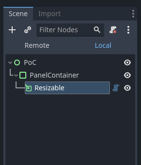
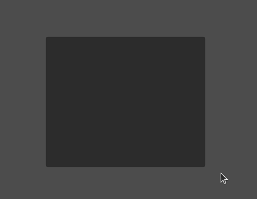

# Godot Resizable
This is a Godot 4 plugin. This custom node will make its parent resizable. Parent has to extend from `Control`.

# Example
Add the custom node `Resizable` as a child to any `Control` node. Below, I added in a `PanelContainer` node.

This will result in a resizable panel:

The final result can be better visualized in [this video](https://www.youtube.com/watch?v=0JDdLFubTk4).